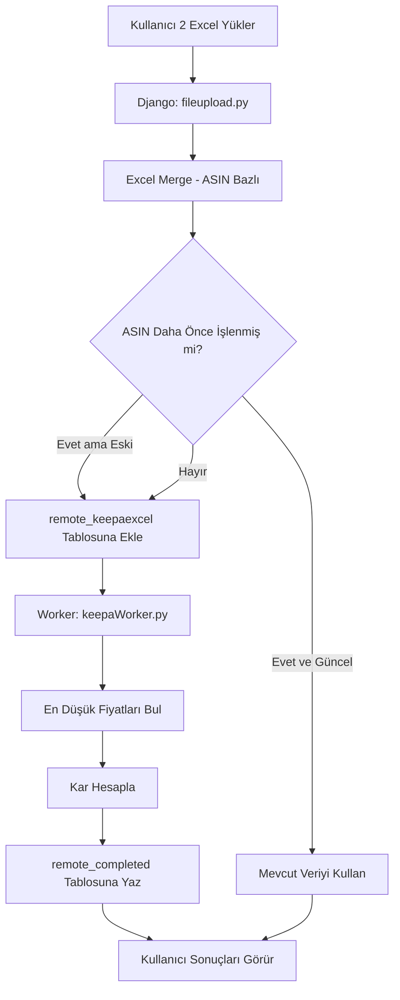

# 📦 Amazon FBA Arbitrage Analysis System

> **Dağıtık yapıda çalışan, Amazon SP-API ve Keepa entegrasyonlu, çoklu pazar arbitraj analiz platformu**

---

## 📑 İçindekiler

- [Genel Bakış](#-genel-bakış)
- [Sistem Mimarisi](#-sistem-mimarisi)
- [Özellikler](#-özellikler)
- [Teknoloji Stack](#-teknoloji-stack)
- [Kurulum](#-kurulum)
- [Veritabanı Yapısı](#-veritabanı-yapısı)
- [Veri Akışı](#-veri-akışı)
- [Detaylı Fonksiyon Açıklamaları](#-detaylı-fonksiyon-açıklamaları)
- [API Kullanımı](#-api-kullanımı)
- [Worker Sistemi](#-worker-sistemi)

---

## 🎯 Genel Bakış

Bu proje, **Amazon FBA (Fulfillment by Amazon) arbitrajı** için geliştirilmiş kapsamlı bir analiz ve otomasyon sistemidir. Sistem, ABD Amazon pazarından ürün satın alıp, diğer uluslararası Amazon pazarlarında (UK, CA, JA, AU, DE, FR) satarak kar elde etme fırsatlarını otomatik olarak tespit eder.

### Ana Hedefler:
✅ Farklı pazarlar arasında fiyat farklarını tespit etme  
✅ Karlılık hesaplamaları (Amazon ücretleri, kargo, vergi, kur dahil)  
✅ Satış hızı ve rekabet analizi  
✅ Çoklu kullanıcı desteği  
✅ Excel ve manuel ASIN yükleme  

---

## 🏗 Sistem Mimarisi

Proje **iki ana bileşenden** oluşur:

```
┌─────────────────────────────────────────────────────────┐
│                    KULLANICI (Web Browser)              │
└────────────────────┬────────────────────────────────────┘
                     │
                     ▼
┌─────────────────────────────────────────────────────────┐
│          AMAZON2FAKE (Django Web Uygulaması)            │
│  ┌──────────────────────────────────────────────────┐   │
│  │  • Kullanıcı Arayüzü                              │   │
│  │  • ASIN Yükleme (Manuel/Excel)                    │   │
│  │  • Filtreleme ve Sıralama                         │   │
│  │  • Pool Yönetimi                                  │   │
│  │  • Excel İndirme                                  │   │
│  └──────────────────────────────────────────────────┘   │
└────────────────────┬────────────────────────────────────┘
                     │
                     ▼
┌─────────────────────────────────────────────────────────┐
│         PYTHONANYWHERE MYSQL DATABASE (Shared)          │
│  ┌──────────────────────────────────────────────────┐   │
│  │  Tables (Her pazar için):                        │   │
│  │  • remote_completed{market}                      │   │
│  │  • remote_notcompleted{market}                   │   │
│  │  • remote_keepaexcel{market}                     │   │
│  └──────────────────────────────────────────────────┘   │
└────────────────────┬────────────────────────────────────┘
                     │
                     ▼
┌─────────────────────────────────────────────────────────┐
│              AMZSRVR (Backend Worker)                   │
│  ┌──────────────────────────────────────────────────┐   │
│  │  • Sonsuz Döngü Controller                       │   │
│  │  • Amazon SP-API Entegrasyonu                    │   │
│  │  • Keepa Excel İşleme                            │   │
│  │  • Multithreading                                │   │
│  │  • Kar Hesaplama Algoritması                     │   │
│  └──────────────────────────────────────────────────┘   │
└─────────────────────────────────────────────────────────┘
```

### 1️⃣ **amazon2fake** (Frontend - Django)
- **Rol:** Kullanıcı arayüzü ve veri yönetimi
- **Teknoloji:** Django 4.1+, MySQL + SQLite
- **Sorumluluklar:**
  - Kullanıcı kimlik doğrulama
  - ASIN girişi (Manuel/Excel)
  - Veri görselleştirme ve filtreleme
  - Pool sistemi (favori ürünler)
  - Excel export

### 2️⃣ **amzsrvr** (Backend Worker - Python)
- **Rol:** Arka plan veri işleme ve API entegrasyonu
- **Teknoloji:** Python 3.x, SP-API, Threading
- **Sorumluluklar:**
  - Amazon SP-API'dan fiyat çekme
  - Keepa Excel verilerini işleme
  - Kar hesaplama (vergi, kur, Amazon ücretleri)
  - Veritabanına sonuç yazma

---

## ✨ Özellikler

### 👤 Kullanıcı Yönetimi
- **Kayıt/Giriş:** Standart Django authentication
- **Kullanıcı İzolasyonu:** Her kullanıcı sadece kendi verilerini görür
- **Admin Paneli:** Süper kullanıcılar tüm verilere erişebilir

### 📥 Veri Girişi

### 🔗 Keepa Entegrasyonu (Endüstri Uyumluluğu)

**Neden Keepa?**

Keepa, Amazon arbitraj dünyasında **endüstri standardı** bir araçtır. Bu sistem, Keepa raporlarını destekleyerek popüler arbitraj yazılımlarıyla tam uyumlu çalışır.

#### Uyumlu Yazılımlar:
- 📊 **Tactical Arbitrage:** En popüler arbitraj aracı
- 🔍 **AZInsight:** Amazon ürün araştırma eklentisi
- 📈 **SellerAmp SAS:** Hızlı kar hesaplama aracı
- 💎 **InventoryLab:** FBA envanter yönetimi
- 🎯 **Keepa Browser Extension:** Fiyat geçmişi ve veri export

**Avantajları:**
✅ **Toplu İşlem:** Tek seferde yüzlerce ASIN işlenebilir  
✅ **Zengin Veri:** Fiyat geçmişi, sales rank, drop count otomatik gelir  
✅ **Maliyet Tasarrufu:** Keepa API kullanımı, Amazon SP-API'dan daha ucuz  
✅ **Workflow Entegrasyonu:** Tactical Arbitrage → Keepa Export → Bu Sistem  
✅ **Hız:** Excel verisi lokal işlenir, API bekleme süresi yok  

#### Desteklenen Keepa Rapor Formatı

**İki Excel Dosyası Gereklidir:**

**1. COM Excel (ABD Pazarı - Alış Fiyatları)**

Gerekli sütunlar:
```
- Title
- ASIN
- Buy Box: Current
- New: Current
- New, 3rd Party FBA: Current
- New, 3rd Party FBM: Current
```

**2. TARGET Excel (Hedef Pazar - Satış Fiyatları)**

Gerekli sütunlar:
```
- ASIN
- Sales Rank: Current
- Sales Rank: Drops last 30 days
- Sales Rank: 90 days avg.
- Buy Box: Current
- Buy Box: Lowest
- New: Current
- New, 3rd Party FBA: Current
- New, 3rd Party FBM: Current
- Referral Fee %
- FBA Fees:
- Buy Box: Is FBA (yes/no)
- Count of retrieved live offers: New, FBA
- Amazon: Current
- Package: Dimension (cm³)
- Package: Weight (g)
- Variation ASINs
```

#### Keepa'dan Veri Export Adımları

**Tactical Arbitrage Kullanıcıları İçin:**
```
1. Tactical Arbitrage'da tarama yap
2. Sonuçları filtrele (ROI > %30, Sales Rank < 50,000)
3. "Export to Keepa" butonuna tıkla
4. Keepa'da:
   ├─ US marketplace için rapor al → com_asin.xlsx
   └─ Hedef marketplace için rapor al → target_asin.xlsx
5. Bu sisteme her iki Excel'i yükle
```

**Keepa Browser Extension Kullanıcıları İçin:**
```
1. Amazon'da ürün listesini aç
2. Keepa eklentisini aç
3. "Data" sekmesine git
4. "Export to Excel" seç
5. Gerekli kolonları işaretle (yukarıdaki liste)
6. İndir ve sisteme yükle
```

#### Sistem Nasıl İşler?

**Keepa Excel Yükleme Akışı:**


**Kod İçinde Sütun Mapping:**
```python
# fileupload.py:25-46
columns_to_rename_com = {
    'New, 3rd Party FBM: Current': 'Buy_Price_FBM',
    'New, 3rd Party FBA: Current': 'Buy_Price_FBA',
    'New: Current': 'Buy_Price_NC',
    'Buy Box: Current': 'Buy_Price_BB'
}

columns_to_rename_target = {
    'Sales Rank: Current': 'SalesRank',
    'Sales Rank: Drops last 30 days': 'Drop_Count',
    'New, 3rd Party FBM: Current': 'Sale_Price_FBM',
    'New, 3rd Party FBA: Current': 'Sale_Price_FBA',
    'New: Current': 'Sale_Price_NC',
    'Buy Box: Current': 'Sale_Price_BB',
    'Referral Fee %': 'Referral_Fee_Percentage',
    'FBA Fees:': 'Pick_and_Pack_Fee',
    'Buy Box: Is FBA': 'Is_Buybox_Fba',
    'Count of retrieved live offers: New, FBA': 'Fba_Seller_Count',
    'Amazon: Current': 'Amazon_Current',
    'Package: Dimension (cm³)': 'Dimension',
    'Package: Weight (g)': 'Weight',
    'Sales Rank: 90 days avg.': 'SalesRank90',
    'Buy Box: Lowest': 'Buybox_Lowest',
    'Variation ASINs': 'Variation_Asins'
}
```

#### Keepa vs Manuel ASIN Farkı

| Özellik | Keepa Excel | Manuel ASIN |
|---------|-------------|-------------|
| **Hız** | ⚡ Çok Hızlı (API yok) | 🐌 Yavaş (SP-API bekler) |
| **Veri Kaynağı** | 📊 Keepa veritabanı | 🔴 Canlı Amazon API |
| **Maliyet** | 💰 Ucuz (Keepa aboneliği) | 💸 Pahalı (SP-API quota) |
| **Tazelik** | 📅 Keepa güncelleme sıklığı | ⚡ Gerçek zamanlı |
| **Toplu İşlem** | ✅ 500+ ASIN tek seferde | ❌ Tek tek işlenir |
| **Amazon Ücretleri** | 📈 Keepa tahmini | 🎯 SP-API gerçek ücret |
| **Kullanım Senaryosu** | İlk tarama | Seçilmiş ürün kontrolü |

#### Önemli Notlar

> [!WARNING]
> **Excel Formatı Kritik!**
> Keepa'nın sütun isimleri zaman zaman değişebilir. Eğer "Excel Hatalı" hatası alırsanız:
> 1. `fileupload.py:22-46` satırlarındaki sütun isimlerini kontrol edin
> 2. Keepa'nın güncel rapor formatıyla karşılaştırın
> 3. Gerekirse `columns_to_rename_*` dictionary'lerini güncelleyin

> [!TIP]
> **En İyi Workflow:**
> 1. Tactical Arbitrage ile geniş tarama yap (1000+ ASIN)
> 2. Keepa Excel export al
> 3. Bu sisteme yükle (hızlı kar hesaplama)
> 4. Karlı olanları Pool'a ekle
> 5. Pool'dakileri manuel ASIN olarak tekrar kontrol et (güncel fiyat)
> 6. Nihai kararı ver ve satın al

---

#### 1. Manuel ASIN Girişi
```python
# views.py: fbaMarketPage -> POST: 'asin_text_upload'
# Kullanıcı, textarea'ya ASIN listesi yapıştırır
# Sistem her ASIN'i:
#   - Veritabanında kontrol eder
#   - Güncel mi değil mi kontrol eder (1 günden eski ise yeniden işler)
#   - NotCompleted tablosuna ekler
```

#### 2. Keepa Excel Yükleme
```python
# fileupload.py: keepa_excel()
# İki Excel dosyası gereklidir:
#   1. COM Excel: ABD pazarı alış fiyatları
#   2. TARGET Excel: Hedef pazar satış fiyatları
# Sistem:
#   - İki dosyayı merge eder
#   - KeepaExcel tablosuna yazar
#   - Worker işleme almak üzere bekler
```

### 🧠 Akıllı Veri Önbellekleme (1 Günlük Tazelik Kontrolü)

**Amaç:** Gereksiz API çağrılarını önlemek ve maliyeti düşürmek

#### Nasıl Çalışır?

Kullanıcı manuel ASIN girdiğinde, sistem **4 farklı senaryo** uyguluyor:

##### Senaryo 1: ASIN İlk Kez Ekleniyor
```python
# Kullanıcı: B07XYZ1234 ASIN'ini giriyor (ilk kez)
# Sistem:
#   1. remote_completeduk'da bu ASIN var mı? → YOK
#   2. remote_keepaexceluk'da var mı? → YOK
#   3. Aksiyon:
#      ├─ remote_completeduk'a boş kayıt ekle (User + Asin)
#      └─ remote_notcompleteduk'a ekle
# Sonuç: Worker API'ya gidecek, tüm verileri çekecek
```

##### Senaryo 2: ASIN Daha Önce İşlenmiş VE Güncel (1 Günden Yeni)
```python
# Kullanıcı: B07XYZ1234 ASIN'ini tekrar giriyor
# Sistem:
#   1. remote_completeduk'da bu ASIN var mı? → VAR
#   2. Profit_Percentage NULL mu? → DOLU (işlenmiş)
#   3. Date alanı ne zaman? → 2025-12-10 (1 gün önce)
#   4. Bugün - Date = 1 gün → GÜNCEL!
#   5. Aksiyon:
#      ├─ Kullanıcının bu ASIN'i daha önce eklemiş mi kontrol et
#      │  ├─ Eklemiş VE Is_Deleted_By_User=True ise:
#      │  │  └─ Is_Deleted_By_User=False yap (geri getir)
#      │  └─ Eklememişse:
#      │     └─ Mevcut kaydı KOPYALA (yeni User ile)
#      └─ NOT: NotCompleted'e EKLEME (API'ya gitmesin)
# Sonuç: Mevcut veriyi kullan, API maliyeti = 0
```

**Kod Detayı (views.py:193-219):**
```python
try:
    # ASIN daha önce işlenmiş mi kontrol et
    check = completedDatas.objects.filter(~Q(Profit_Percentage=None), Asin=asin)
    
    # Tarih farkını hesapla
    check2nd = datetime.now().date() - check[0].Date
    
    if (check2nd).days >= 1:
        # 1 GÜNDEN ESKİ → Yeniden işle
        try:
            product = notCompletedDatas.objects.get(Asin=asin)
        except:
            notcompleted = notCompletedDatas(Asin=asin)
            notcompleted.save()
        finally:
            product = completedDatas(User=request.user, Asin=asin)
            product.save()
    else:
        # 1 GÜNDEN YENİ → Mevcut veriyi kullan
        try:
            existing_user_product = check.filter(User=request.user)
            existing_user_product = existing_user_product[0]
            if existing_user_product.Is_Deleted_By_User == True:
                existing_user_product.Is_Deleted_By_User = False
                existing_user_product.save()
        except:
            # Kullanıcının kaydı yoksa kopyala
            new = check[0]
            new._state.adding = True  # Django'ya "yeni kayıt" olduğunu söyle
            new.pk = None              # Primary key'i sıfırla
            new.User = request.user    # Yeni kullanıcı ata
            new.Is_Deleted_By_User = False
            new.save(using='mysql')
except:
    # ASIN hiç işlenmemiş → Normal akış
    ...
```

##### Senaryo 3: ASIN İşlenmiş AMA Eski (1 Günden Fazla)
```python
# Kullanıcı: B07XYZ1234 ASIN'ini giriyor
# Sistem:
#   1. remote_completeduk'da var mı? → VAR
#   2. Date = 2025-12-05 (6 gün önce)
#   3. Bugün - Date = 6 gün > 1 gün → ESKİ!
#   4. Aksiyon:
#      ├─ Kullanıcı için YENİ boş kayıt oluştur
#      ├─ remote_notcompleteduk'a ekle
#      └─ Kullanıcının eski kaydı Is_Deleted_By_User=False yap
# Sonuç: Worker API'ya gidecek, güncel fiyatları çekecek
```

**Neden 1 Gün Süresi?**
- Amazon fiyatları hızla değişir (günde birkaç kez)
- 1 günden eski veri güvenilmez (fiyat değişmiş olabilir)
- 1 günden yeni veri makul bir tazelik garantisi verir

##### Senaryo 4: ASIN Keepa'da Var AMA Completed'de Yok
```python
# Kullanıcı: B07XYZ1234 ASIN'ini giriyor
# Sistem:
#   1. remote_completeduk'da yok
#   2. remote_keepaexceluk'da VAR (Excel yüklenmişti)
#   3. Aksiyon:
#      ├─ Keepa verisini al (Title, SalesRank, FBA count, vb.)
#      ├─ remote_completeduk'a DOLU kayıt ekle (Keepa verileriyle)
#      └─ NOT: NotCompleted'e EKLEME (Keepa verisi yeterli)
# Sonuç: Keepa verisini kullan, SP-API'ya gitmeye gerek yok
```

**Kod Detayı (views.py:221-234):**
```python
try:
    # Keepa'da var mı kontrol et
    product_keepa = keepaExcelDatas.objects.get(Asin=asin)
    
    # Keepa verileriyle direkt Completed'e kaydet
    product = completedDatas(
        User=request.user,
        Title=product_keepa.Title,
        Asin=asin,
        SalesRank=product_keepa.SalesRank,
        SalesRank90=product_keepa.SalesRank90,
        Is_Buybox_Fba=product_keepa.Is_Buybox_Fba,
        Buybox_Lowest=product_keepa.Buybox_Lowest,
        Variation_Asins=product_keepa.Variation_Asins,
        Fba_Seller_Count=product_keepa.Fba_Seller_Count,
        Weight=product_keepa.Weight,
        Amazon_Current=product_keepa.Amazon_Current
    )
    product.save()
except:
    # Keepa'da da yok → Normal akış (NotCompleted'e ekle)
    ...
```

#### Maliyet Tasarrufu Hesabı

**Örnek:**
- 100 kullanıcı var
- Her kullanıcı günde ortalama 20 ASIN ekliyor
- %70'i daha önce başka kullanıcı tarafından işlenmiş

**Akıllı önbellekleme OLMADAN:**
```
Günlük API çağrısı = 100 kullanıcı × 20 ASIN × 3 API endpoint = 6,000 çağrı/gün
```

**Akıllı önbellekleme İLE:**
```
%70 cache hit (önbellekten) → 0 API çağrısı
%30 cache miss (yeni/eski) → 100 × 20 × 0.30 × 3 = 1,800 çağrı/gün

Tasarruf = 6,000 - 1,800 = 4,200 çağrı/gün (%70 azalma!)
```

#### Keepa Excel İçin Benzer Mantık

`fileupload.py` dosyasında da aynı 1 günlük kontrol var:

```python
# fileupload.py:125-132
try:
    check = completed_db.objects.filter(~Q(Profit_Percentage=None), Asin=ASIN)
    check2nd = datetime.now().date() - check[0].Date
    
    if (check2nd).days >= 1:
        # ESKİ → NotCompleted'e ekle, Worker işlesin
        check_to_notCompleted_db(...)
    else:
        # YENİ → Kullanıcı için kopyala
        ...
except:
    # YOK → Normal işle
    check_to_notCompleted_db(...)
```

#### Özellik Avantajları

✅ **Maliyet Düşürme:** Amazon SP-API çağrılarını %70'e kadar azaltır  
✅ **Hız:** Kullanıcı anında sonuç görür (API beklemesi yok)  
✅ **Rate Limiting Koruması:** API limitlerini aşma riskini düşürür  
✅ **Veri Tazeliği:** 1 günden yeni veriler güvenilir  
✅ **Kullanıcı Deneyimi:** Popüler ürünler hızlıca yüklenir  

#### Dikkat Edilmesi Gerekenler

⚠️ **Güncel Olmayan Veriler:** Eğer fiyatlar çok hızlı değişiyorsa, elle yenilemek gerekebilir  
⚠️ **Silinmiş Ürünler:** Kullanıcı silip tekrar eklerse, aynı eski veri gelir  
⚠️ **Pool Kullanımı:** Pool'daki ürünleri güncellemek için silip tekrar eklemek gerekir  


### 🔍 Filtreleme ve Sıralama
Kullanıcılar şu kriterlere göre ürünleri filtreleyebilir:
- **Kar Yüzdesi (Profit Percentage):** Min/Max
- **Drop Count:** 30 günde kaç kez fiyat düştü
- **Satış Sayısı (Sales Info)**
- **FBA Satıcı Sayısı**
- **Amazon Satış Fiyatı**
- **Ağırlık (Weight/Lbs)**

Sıralama seçenekleri:
- Kar yüzdesine göre (Yüksek → Düşük / Düşük → Yüksek)
- FBA satıcı sayısına göre
- Satış sayısına göre

### 🗂 Pool Sistemi
- Kullanıcılar, beğendikleri ürünleri "Pool"a ekleyebilir
- Pool, favori ürünlerin toplanması için kullanılır
- Pool'dan ana listeye geri taşıma mümkündür

### 🗑 Silme/Geri Yükleme
- Kullanıcılar ürünleri sildiğinde, veritabanından **silinmez**
- Sadece `Is_Deleted_By_User=True` olarak işaretlenir
- "Deleted" sayfasından tekrar geri yüklenebilir

### 📊 Excel Export
- Filtrelenmiş veriler Excel olarak indirilebilir
- Türkçe başlıklar içerir
- Tüm önemli alanları içerir (Kar, Ratio, SalesRank, vb.)

---

## 🛠 Teknoloji Stack

### Django (amazon2fake)
```python
- Django 4.1.1
- django-pandas (DataFrame entegrasyonu)
- MySQLdb (MySQL connector)
- django-dramatiq (Asenkron görevler için - kurulu ama konfigüre edilmemiş)
```

### Worker (amzsrvr)
```python
- python-amazon-sp-api (SP-API Python SDK)
- pandas (Veri manipülasyonu)
- MySQLdb + sshtunnel (PythonAnywhere SSH bağlantısı)
- google-currency (Kur çevirimi)
- threading (Paralel işlem)
```

### Veritabanları
- **SQLite:** Django default DB (lokal geliştirme)
- **MySQL (PythonAnywhere):** Paylaşılan production database

---

## 🗄 Veritabanı Yapısı

### Tablo Şeması (Her pazar için tekrarlanır: uk, ca, ja, au, fr, de)

#### 1️⃣ `remote_completed{market}` 
**Amaç:** İşlenmiş ve analizi tamamlanmış ürünler

| Alan | Tip | Açıklama |
|------|-----|----------|
| `User` | ForeignKey | Hangi kullanıcıya ait |
| `Asin` | CharField | Amazon ürün kodu |
| `Title` | CharField | Ürün adı |
| `SalesRank` | Integer | Anlık satış sıralaması |
| `SalesRank90` | Integer | 90 günlük ortalama |
| `Drop_Count` | Integer | 30 günde fiyat düşüş sayısı |
| `Buy_Price` | Float | ABD'den alış fiyatı ($) |
| `Sale_Price` | Float | Hedef pazarda satış fiyatı (lokalr para birimi) |
| `Ratio` | Float | Satış/Maliyet oranı (1.5+ karlı kabul edilir) |
| `Cost` | Float | Toplam maliyet (alış + kargo + kur) |
| `Profit` | Float | Net kar |
| `Profit_Percentage` | Float | Kar yüzdesi (Kar/Maliyet) |
| `Sales_Info` | Integer | Tahmini aylık satış sayısı |
| `Date` | Date | Son güncellenme tarihi |
| `Fba_Seller_Count` | Integer | FBA ile satan rekabet sayısı |
| `Is_Buybox_Fba` | Boolean | Buybox FBA mı? |
| `Amazon_Current` | Float | Amazon'un kendi sattığı fiyat |
| `Buybox_Lowest` | Float | En düşük buybox fiyatı |
| `Variation_Asins` | Integer | Varyasyon sayısı |
| `Weight` | Float | Ağırlık (lbs) |
| `Pool` | Boolean | Pool'da mı? |
| `Is_Deleted_By_User` | Boolean | Kullanıcı tarafından silinmiş mi? |
| `Error_Code` | Boolean | İşlemde hata oluştu mu? |

#### 2️⃣ `remote_notcompleted{market}`
**Amaç:** İşlenmeyi bekleyen ASIN kuyruk sistemi

| Alan | Tip | Açıklama |
|------|-----|----------|
| `Asin` | CharField | İşlenecek ASIN |

**İşleyiş:**
- Kullanıcı ASIN girdiğinde buraya yazılır
- Worker bu tabloyu kontrol eder
- İşlendikten sonra buradan silinir ve `remote_completed` tablosuna yazılır

#### 3️⃣ `remote_keepaexcel{market}`
**Amaç:** Keepa'dan yüklenen ham Excel verileri

| Alan | Tip | Açıklama |
|------|-----|----------|
| `Asin` | CharField | Ürün kodu |
| `Title` | CharField | Ürün adı |
| `SalesRank` | Integer | Satış sıralaması |
| `SalesRank90` | Integer | 90 günlük ortalama |
| `Drop_Count` | Integer | Fiyat düşüş sayısı |
| `Buy_Price_FBA/FBM/BB/NC` | Float | ABD farklı satıcı tipleri alış fiyatları |
| `Sale_Price_FBA/FBM/BB/NC` | Float | Hedef pazar satış fiyatları |
| `Referral_Fee_Percentage` | Float | Amazon komisyon oranı |
| `Pick_and_Pack_Fee` | Float | FBA işlem ücreti |
| `Is_Buybox_Fba` | Boolean | Buybox FBA mı? |
| `Fba_Seller_Count` | Integer | FBA satıcı sayısı |
| `Amazon_Current` | Float | Amazon satış fiyatı |
| `Weight` | Float | Ağırlık |
| `Variation_Asins` | Integer | Varyasyon sayısı |
| `Buybox_Lowest` | Float | En düşük buybox |

**İşleyiş:**
- Excel yüklendiğinde buraya yazılır
- KeepaWorker bu verileri işler
- İşlem sonrası buradan silinir ve `remote_completed`'e yazılır

#### 4️⃣ `remote_exceldata`
**Amaç:** Yüklenen Excel dosyalarının kaydı

| Alan | Tip | Açıklama |
|------|-----|----------|
| `Userx` | ForeignKey | Yükleyen kullanıcı |
| `Market` | CharField | Hedef pazar (uk, ca, vb.) |
| `com_asin` | FileField | ABD Excel dosyası |
| `target_asin` | FileField | Hedef pazar Excel dosyası |
| `Is_executed` | Boolean | İşlendi mi? |
| `DateTime` | DateTime | Yüklenme zamanı |

---

## 🔄 Veri Akışı

### Senaryo 1: Manuel ASIN Girişi

```
1. KULLANICI → Django Web Paneli
   └─ "fba/uk" sayfasında textarea'ya ASIN yapıştırır
   
2. DJANGO (views.py: fbaMarketPage)
   └─ POST isteği alır (asin_text_upload)
   └─ Her ASIN için:
       ├─ Veritabanında var mı kontrol eder (remote_completeduk)
       ├─ Varsa ve 1 günden eskiyse:
       │   └─ remote_notcompleteduk'a ekler (yeniden işlensin)
       └─ Yoksa:
           ├─ remote_completeduk'a boş kayıt atar (User + Asin)
           └─ remote_notcompleteduk'a ekler

3. WORKER (main_controller.py)
   └─ Her 200 saniyede bir döngü çalışır
   └─ remote_notcompleteduk tablosunu kontrol eder
   └─ Yeni kayıt varsa:
       └─ main_worker.py'ye gönderir

4. WORKER (main_worker.py)
   └─ Amazon SP-API'dan veri çeker:
       ├─ get_Buy_Price() → ABD fiyatı, ağırlık, başlık
       ├─ get_Sell_Price() → UK fiyatı, rekabet durumu
       └─ calculate() → Kar hesaplama (kur, kargo, vergi, Amazon fee)
   
5. WORKER (main_controller.py: completed_writer_thread)
   └─ Sonuçları remote_completeduk'a UPDATE eder
   └─ remote_notcompleteduk'dan DELETE eder

6. KULLANICI → Django Web Paneli
   └─ Sayfayı yeniler
   └─ İşlenmiş veriyi görür (Profit, Ratio, vb.)
```

### Senaryo 2: Keepa Excel Yükleme

```
1. KULLANICI → Django Web Paneli
   └─ "fba/ca" sayfasında 2 Excel dosyası yükler:
       ├─ com_asin.xlsx (ABD verileri)
       └─ target_asin.xlsx (CA verileri)

2. DJANGO (fileupload.py: keepa_excel)
   └─ İki Excel'i merge eder (ASIN bazlı)
   └─ Her satır için:
       ├─ remote_keepaexcelca'ya kayıt ekler (ham veri)
       └─ remote_completedca'ya basit kayıt ekler (Title, SalesRank vb.)

3. WORKER (main_controller.py)
   └─ remote_keepaexcelca tablosunu kontrol eder
   └─ Yeni kayıt varsa:
       └─ keepaWorker.py'ye gönderir

4. WORKER (keepaWorker.py)
   └─ Keepa verilerini işler:
       ├─ get_Com() → ABD en düşük fiyatı bulur (FBA/FBM/BB karşılaştırması)
       ├─ get_Target() → CA en düşük fiyatı bulur
       └─ calculate_Final() → Kar hesaplama (Vergi, referral fee, fba fee)

5. WORKER (keepaWorker.py)
   └─ remote_completedca'ya UPDATE eder (Buy_Price, Sale_Price, Profit...)
   └─ remote_keepaexcelca'dan DELETE eder

6. KULLANICI → Django Web Paneli
   └─ İşlenmiş ürünleri görür
```

---

## 📋 Detaylı Fonksiyon Açıklamaları

### Django (amazon2fake/remote/views.py)

#### `fbaHomePage(request)`
**Amaç:** Ana pazar seçim sayfası  
**İşlev:**
- Mevcut pazarları listeler: UK, CA, JA, AU, FR, DE
- Template: `fbahome.html`

#### `fbaMarketPage(request, country)`
**Amaç:** Pazara özgü ürün listesi ve yönetim sayfası  
**Parametreler:**
- `country`: Pazar kodu (uk, ca, vb.)

**GET İşlemleri:**
- Kullanıcının o pazardaki tüm ürünlerini gösterir
- Filtreleme parametrelerini uygular:
  - `drop_count_min/max`
  - `profit_percentage_min/max`
  - `sales_info_min/max`
  - `fba_seller_count_min/max`
  - `amazon_sale_price_min/max`
  - `weight_min/max`
- Sıralama parametreleri:
  - `sortByProfitPercentage`: h2l (yüksekten düşüğe), l2h (tam tersi)
  - `sortByFBASeller`
  - `sortBySalesInfo`

**POST İşlemleri:**

1. **`asin_text_upload`**: Manuel ASIN yapıştırma
   ```python
   # Kullanıcı textarea'ya ASIN listesi yapıştırır (her satır bir ASIN)
   # Sistem:
   #   - ASIN'i trim eder (\r\n temizler)
   #   - Veritabanında varsa:
   #       - 1 günden eskiyse → NotCompleted'e ekle
   #       - 1 günden yeniyse → Completed'deki kaydı kopyala
   #   - Yoksa:
   #       - Keepa'da varsa → Keepa verisini Completed'e aktar
   #       - Keepa'da da yoksa → Boş kayıt + NotCompleted'e ekle
   ```

2. **`asin_file_upload`**: Excel yükleme
   ```python
   # excelData modeline kaydeder
   # Dramatiq worker (şu an pasif) işleyecek
   ```

3. **`send_pool`**: Seçili ürünleri Pool'a ekleme
   ```python
   # Checkbox'larla seçilen ASIN'leri alır
   # Pool=True olarak günceller
   ```

4. **`download_products`**: Excel indirme
   ```python
   # Seçili ürünleri Excel'e çevirir
   # dbdownload() fonksiyonunu çağırır
   ```

5. **`delete_products`**: Ürün silme
   ```python
   # Is_Deleted_By_User=True yapar
   # Gerçek silme işlemi YAPILMAZ
   ```

6. **`all_selected`**: Toplu işlemler
   - `send_pool_all`: Tüm listeyi Pool'a ekle
   - `download_all`: Tüm listeyi Excel olarak indir
   - `delete_all`: Tüm listeyi sil

#### `fbaMarketPoolPage(request, country)`
**Amaç:** Pool'daki ürünler  
**İşlev:**
- `Pool=True` olan ürünleri gösterir
- Filtreleme ve sıralama destekler
- Pool'dan çıkarma (Pool=False) özelliği

#### `fbaMarketDeletedPage(request, country)`
**Amaç:** Silinen ürünler  
**İşlev:**
- `Is_Deleted_By_User=True` olanları gösterir
- Geri yükleme (Is_Deleted_By_User=False) özelliği

#### `dbdownload(country, queryset)`
**Amaç:** Excel export  
**İşlev:**
- Queryset'i Django-Pandas ile DataFrame'e çevirir
- Türkçe sütun isimleri uygular
- Timestamp'li dosya adı oluşturur
- `static/downloaded_datas/` klasörüne kaydeder
- HTTP response ile download link döner

#### `product_filter(key, value, data, notOrderedData)`
**Amaç:** Filtreleme yardımcı fonksiyonu  
**İşlev:**
- GET parametrelerine göre queryset'i filtreler
- Django ORM filtrelerini uygular (`__gte`, `__lte`, `order_by`)

---

### Django (amazon2fake/remote/fileupload.py)

#### `keepa_excel(com_file, target_file, keepa_db, completed_db, notCompleted_db, user)`
**Amaç:** Keepa Excel dosyalarını işleme  
**Parametreler:**
- `com_file`: ABD Excel dosyası (alış fiyatları)
- `target_file`: Hedef pazar Excel dosyası (satış fiyatları)
- `keepa_db`: KeepaExcel model (UK, CA, vb.)
- `completed_db`: Completed model
- `notCompleted_db`: NotCompleted model
- `user`: Yükleyen kullanıcı

**İşleyiş:**
```python
1. Excel dosyalarını pandas ile okur
2. Sütun isimlerini veritabanı alanlarına map eder
3. İki DataFrame'i ASIN bazlı merge eder
4. Boş değerleri -21 ile doldurur (NaN kontrolü için)
5. Her satır için:
    a. ASIN veritabanında var mı kontrol eder
    b. Varsa:
        - 1 günden eskiyse → NotCompleted'e ekle
        - Yeniyse → Kullanıcı için kopyala
    c. Yoksa:
        - check_to_notCompleted_db() çağrısı
6. Keepa verisini keepa_db'ye kaydeder (dataSaver)
7. Completed tablosuna basit kayıt ekler (get_or_create_completed)
```

**Önemli Detaylar:**
- Ağırlık hesaplama: `max(WEIGHT * 0.0022046226, DIMENSION * 0.0610237 / 135)`
  - WEIGHT: gram → lbs çevrimi
  - DIMENSION: cm³ → lbs dimitrik ağırlık
  - İkisinden büyük olanı alır (taşıma ücreti hesabı için)

- Varyasyon sayısı: `VARIATION_ASINS.count(',') + 1`
  - Keepa varyasyonları virgülle ayırır: "B07X,B07Y,B07Z" → 3 varyasyon

#### `check_to_notCompleted_db(...)`
**Amaç:** NotCompleted tablosundan silme ve Completed güncelleme  
**İşlev:**
- NotCompleted'de varsa siler
- Completed'deki boş alanları doldurur (Title, SalesRank, vb.)

#### `dataSaver(...)`
**Amaç:** KeepaExcel tablosuna kaydetme  
**İşlev:**
- ASIN varsa günceller, yoksa yeni kayıt yapar
- `using='mysql'` parametresi ile MySQL'e yazar

#### `get_or_create_completed(...)`
**Amaç:** Kullanıcı için Completed kaydı oluşturma  
**İşlev:**
- Kullanıcı + ASIN kombinasyonu yoksa yeni kayıt atar
- Başlangıç verileri: Title, SalesRank, Weight, vb.
- Kar hesaplamaları boş bırakılır (Worker dolduracak)

---

### Worker (amzsrvr/main_controller.py)

#### Sonsuz Döngü Mantığı
```python
while True:
    # 1. Veritabanından veri çek
    for market in markets:
        query = f"SELECT * from remote_notcompleted{market.target}"
        market.notcompleted = pd.read_sql(query, connection)
        
        query = f"SELECT * from remote_keepaexcel{market.target}"
        market.keepaexcel = pd.read_sql(query, connection)
    
    # 2. İşlenecek veri miktarını hesapla
    total_notcompleted = sum(len(m.notcompleted) for m in markets)
    total_keepaexcel = sum(len(m.keepaexcel) for m in markets)
    
    # 3. Her pazar için ağırlıklı parçalama
    for market in markets:
        ratio = len(market.notcompleted) / total_notcompleted
        slice_df = market.notcompleted.tail(int(ratio * 100))
        
        # 4. Worker'lara gönder (Threading)
        if len(slice_df) >= 1:
            market.completed_asin = work(slice_df, us_market, market.my_market_place)
        
        keepa_ratio = len(market.keepaexcel) / total_keepaexcel
        slice_keepa = market.keepaexcel.tail(int(keepa_ratio * 200))
        
        if len(slice_keepa) >= 1:
            t1 = threading.Thread(target=keepa_worker_thread, args=[...])
            t1.start()
    
    # 5. Sonuçları veritabanına yaz
    if total_completed > 0:
        completed_writer_thread()
    
    # 6. 200 saniye bekle
    time.sleep(200)
```

#### `completed_writer_thread()`
**Amaç:** İşlenmiş verileri veritabanına yazmak  
**İşlev:**
```python
for market in markets:
    for i in range(len(market.completed_asin)):
        # Tüm alanları (Profit, Ratio, SalesRank, vb.) UPDATE eder
        query = f"""UPDATE remote_completed{market.target} 
                    SET SalesRank={x}, Buy_Price={y}, ... 
                    WHERE Asin='{asin}'"""
        cursor.execute(query)
        
        # NotCompleted'den siler
        query = f"DELETE FROM remote_notcompleted{market.target} WHERE Asin='{asin}'"
        cursor.execute(query)
```

---

### Worker (amzsrvr/main_worker.py)

#### `work(slice_of_df, us_market, target_market)`
**Amaç:** Ana işleme fonksiyonu  
**Parametreler:**
- `slice_of_df`: İşlenecek ASIN'lerin DataFrame'i
- `us_market`: ABD pazar bilgileri (credentials, marketplace)
- `target_market`: Hedef pazar bilgileri

**İşleyiş:**
```python
# 1. Global DataFrame oluştur
main_dataframe = pd.merge(boş_df, slice_of_df['Asin'], on='Asin')

# 2. Sonsuz döngü (tüm veriler işlenene kadar)
while True:
    # 3. İşlenecek ASIN'leri filtrele
    buy_price_df = main_df[(Error==False) & (Buy_Price.isnull())]
    sale_price_df = main_df[(Error==False) & (Buy_Price.notnull()) & (Sale_Price.isnull())]
    profit_df = main_df[(Error==False) & (Buy_Price.notnull()) & (Sale_Price.notnull()) & (Profit.isnull())]
    
    # 4. Hiç işlenecek veri kalmadıysa ÇIKIŞ
    if (buy_price_df.count() + sale_price_df.count() + profit_df.count()) <= 0:
        break
    
    # 5. Threading ile paralel işlem
    threads = []
    
    for asin in buy_price_df:
        t = threading.Thread(target=get_Buy_Price, args=[asin, us_market.credentials])
        threads.append(t)
        t.start()
    
    for asin in sale_price_df:
        t = threading.Thread(target=get_Sell_Price, args=[asin, target_market.credentials, target_market.marketplace])
        threads.append(t)
        t.start()
    
    for asin in profit_df:
        t = threading.Thread(target=calculate, args=[asin, ...])
        threads.append(t)
        t.start()
    
    # 6. Tüm thread'lerin bitmesini bekle
    for thread in threads:
        thread.join()
    
    # 7. Her 10 iterasyonda 5 saniye soluklan (rate limiting)
    if k % 10 == 0:
        time.sleep(5)

# 8. İşlenmiş DataFrame'i döndür
return main_dataframe
```

#### `get_Buy_Price(asin, credentials)`
**Amaç:** ABD pazarından alış fiyatını çekmek  
**API Çağrıları:**
1. **Products.get_item_offers()**: Fiyat bilgisi
   - `LowestPrices` içinden en düşük fiyatı bulur
   - Condition: "new" olanları filtreler

2. **Catalog.get_item()**: Ürün detayları
   - Title
   - PackageDimensions (Ağırlık ve boyut hesaplama)
   - SalesRank

**Hata Yönetimi:**
```python
exception_codes = {
    'PackageDimensions': -8888,
    'Low_Ratio': -777777,
    'Unauthorized': -666666,
    'InvalidInput': -555555,
    'feesEstimate': -444444,
    'BuyboxPrices': -333333,
    'LowestPrices': -222222,
    'noCredential': -111111
}

# Hata olduğunda:
#   - Error_Code = True
#   - Buy_Price = exception_code (negatif sayı)
```

#### `get_Sell_Price(asin, credentials, target_marketplace)`
**Amaç:** Hedef pazardan satış fiyatını çekmek  
**API Çağrısı:**
- **Products.get_item_offers()** (hedef pazar için)

**Çıkarılan Veriler:**
- `lowestSellPrice`: En düşük satış fiyatı
- `Is_Buybox_Fba`: Buybox FBA tarafından mı kazanılmış?
- `Fba_Seller_Count`: FBA satıcı sayısı
- `Amazon_Current`: Amazon kendi satıyor mu? (SellerId kontrolü)

**Amazon Satıcı Tespiti:**
```python
amazon_Market_place_Ids = [
    'A3DWYIK6Y9EEQB',  # CA
    'AN1VRQENFRJN5',   # JA
    'ANEGB3WVEVKZB',   # AU
    'A3JWKAKR8XB7XF',  # DE
    'A1X6FK5RDHNB96'   # FR
]

for offer in targetResponse['Offers']:
    if offer['SellerId'] in amazon_Market_place_Ids:
        Amazon_Current = offer['ListingPrice']['Amount']
```

#### `calculate(asin, credentials, target_marketplace, lowestBuyPrice, lowestSellPrice, shipping_cost, curr_rate, curr_type, minRatio)`
**Amaç:** Kar hesaplama

**Formüller:**

1. **Maliyet (Cost):**
   ```python
   cost = (lowestBuyPrice + shipping_cost + 1) * curr_rate
   # lowestBuyPrice: ABD fiyatı ($)
   # shipping_cost: Sabit kargo maliyeti ($3)
   # +1: Ek işlem gideri
   # curr_rate: Dolar → Hedef para birimi kuru
   ```

2. **Ratio (Oran):**
   ```python
   ratio = lowestSellPrice / cost
   # Eğer ratio >= 1.5 ise karlı kabul edilir
   # Değilse → Profit = -777777 (Low_Ratio hatası)
   ```

3. **Kar (Profit):**
   ```python
   # API'den Amazon ücretlerini çek
   productResponse = ProductFees.get_product_fees_estimate_for_asin(asin, lowestSellPrice, ...)
   totalFee = productResponse['TotalFeesEstimate']['Amount']
   
   # Vergi (VAT) hesaplama (sadece DE/FR için)
   vat_cost = 0
   if target == DE or target == FR:
       vat_cost = lowestSellPrice / 6
   
   # Fee çarpanı (UK/DE/FR için VAT dahil)
   fee_mult = 1
   if target in [DE, FR, UK]:
       fee_mult = 1.2
   
   # Net kar
   profit = lowestSellPrice - vat_cost - (totalFee * fee_mult) - cost
   ```

4. **Kar Yüzdesi:**
   ```python
   profit_percentage = profit / cost
   ```

**Önemli Notlar:**
- **KDV (VAT) Düşümü:**
  - DE/FR: Satış fiyatının 1/6'sı KDV olarak düşülür
  - UK/DE/FR: Amazon ücretlerine %20 vergi eklenir

- **Amazon SP-API ProductFees:**
  - Referral fee (komisyon)
  - FBA fulfillment fee (depolama + paketleme)
  - Variable closing fee (kapanış ücreti)

---

### Worker (amzsrvr/keepaWorker.py)

#### `keepa_work(result_dataFrame, target_market, curr_rate, shipping_cost)`
**Amaç:** Keepa Excel verilerinden kar hesaplama

**İşleyiş:**
```python
# 1. DataFrame'i COM ve TARGET olarak ayır
com = result_dataFrame[['Title', 'Asin', 'Buy_Price_FBA', 'Buy_Price_FBM', ...]]
target = result_dataFrame[['Asin', 'SalesRank', 'Sale_Price_FBA', ...]]

# 2. En düşük fiyatları bul
com_final = get_Com(com)          # ABD en düşük alış
target_final = get_Target(target)  # Hedef en düşük satış

# 3. Merge et
data_start = pd.merge(com_final, target_final, on='ASIN')

# 4. Kar hesapla
final_df = calculate_Final(target_market, data_start, curr_rate, shipping_cost)

# 5. Veritabanına UPDATE et
for i in range(len(final_df)):
    query = f"""UPDATE remote_completed{target_market} 
                SET Buy_Price={x}, Sale_Price={y}, Profit={z}, ... 
                WHERE Asin='{asin}'"""
    cursor.execute(query)
    
    # Keepa tablosundan sil
    query = f"DELETE FROM remote_keepaexcel{target_market} WHERE Asin='{asin}'"
    cursor.execute(query)
```

#### `get_Com(target)` / `get_Target(target)`
**Amaç:** En düşük fiyatı bulmak

**Mantık:**
```python
# COM için (Alış - ABD):
# 1. FBA ve FBM ikisi de NULL ise:
#    - BB (BuyBox) varsa → BB fiyatı
#    - BB de yoksa → NC (New Current) fiyatı
# 2. FBA veya FBM varsa:
#    → min(BB, FBA, FBM) en düşük olanı al

# TARGET için (Satış - Hedef pazar):
# Aynı mantık, sadece Sale_Price sütunları kullanılır
```

**Neden bu kadar karmaşık?**
- Keepa'da farklı satıcı tipleri ayrı sütunlarda gelir:
  - **FBA**: Amazon'un deposundan gönderim
  - **FBM**: Satıcının kendi deposundan
  - **BB**: Buybox sahibinin fiyatı
  - **NC**: Yeni ürün genel fiyatı
- Sistem en ucuz seçeneği bulmak zorunda

#### `calculate_Final(market_place, data_start, curr_rate, shipping_cost)`
**Amaç:** Keepa verisi için kar hesaplama

**Formüller:**
```python
# 1. Maliyet
MALIYET = (BUY_PRICE + shipping_cost + 1) * curr_rate

# 2. Oran
ORAN = SALE_PRICE / MALIYET

# 3. Amazon ücretleri (Keepa'dan gelen Referral Fee ve FBA Fee kullanılır)
referral_fee = SALE_PRICE * Referral_Fee_Percentage
pick_and_pack_fee = Pick_and_Pack_Fee

# 4. Vergi hesaplama
if market_place == 'ca' or 'ja' or 'au':
    KAR = SALE_PRICE - referral_fee - pick_and_pack_fee - MALIYET

elif market_place == 'fr' or 'de':
    # KDV düşümü: SALE_PRICE / 6 * 5 (1/6'sı KDV)
    # Ücretlere %20 vergi ekle
    referral_fee_with_tax = referral_fee * 1.2
    pick_and_pack_fee_with_tax = pick_and_pack_fee * 1.2
    KAR = (SALE_PRICE / 6 * 5) - referral_fee_with_tax - pick_and_pack_fee_with_tax - MALIYET

elif market_place == 'uk':
    # KDV düşümü YOK ama ücretlere vergi var
    referral_fee_with_tax = referral_fee * 1.2
    pick_and_pack_fee_with_tax = pick_and_pack_fee * 1.2
    KAR = SALE_PRICE - referral_fee_with_tax - pick_and_pack_fee_with_tax - MALIYET

# 5. Kar yüzdesi
KAR_YUZDE = KAR / MALIYET
```

**Keepa Worker vs SP-API Worker Farkı:**
| Özellik | Keepa Worker | SP-API Worker |
|---------|--------------|---------------|
| Veri Kaynağı | Excel (Keepa export) | Amazon API (canlı) |
| Hız | Çok hızlı (API yok) | Yavaş (rate limiting) |
| Doğruluk | Excel tarihi kadar güncel | Gerçek zamanlı |
| Amazon Ücretleri | Keepa tahminleri | API'dan gerçek veriler |
| Kullanım Senaryosu | Toplu yükleme | Manuel ASIN sorguları |

---

### Worker (amzsrvr/MyMarketPlace.py)

#### `MyMarketPlace(target)`
**Amaç:** Pazar yeri konfigürasyonu

**Özellikler:**
```python
# 1. Amazon SP-API Credentials
credentials = {
    'lwa_app_id': '...',          # Login with Amazon App ID
    'lwa_client_secret': '...',   # Secret key
    'aws_access_key': '...',      # AWS IAM access
    'aws_secret_key': '...',      # AWS IAM secret
    'role_arn': '...',            # AWS IAM role
    'refresh_token': '...'        # Pazara özel token
}

# 2. API Marketplace mapping
marketPlace_dict = {
    'us': Marketplaces.US,
    'ca': Marketplaces.CA,
    'ja': Marketplaces.JP,
    'au': Marketplaces.AU,
    'de': Marketplaces.DE,
    'fr': Marketplaces.FR,
    'uk': Marketplaces.UK
}

# 3. Para birimi mapping
curr_type_dict = {
    'us': 'USD',
    'ca': 'CAD',
    'ja': 'JPY',
    'au': 'AUD',
    'de': 'EUR',
    'fr': 'EUR',
    'uk': 'GBP'
}

# 4. Dinamik kur çevirimi
def current_currency(self):
    if self.curr_type != 'usd':
        temp = google_currency.convert('usd', self.curr_type, 100000)
        curr_rate = float(temp['amount']) / 100000
        return curr_rate
    else:
        return 1
```

**Neden her pazar için ayrı refresh_token?**
- Amazon SP-API her pazar için ayrı yetkilendirme gerektirir
- US/CA → Aynı token kullanabilir
- EU (UK/DE/FR) → Aynı token
- Japonya → Ayrı token
- Avustralya → Ayrı token

---

## 🔌 API Kullanımı

### Amazon SP-API (Selling Partner API)

#### Kullanılan Endpoint'ler:

1. **Products.get_item_offers(asin, condition='New')**
   - **Amaç:** Fiyat ve rekabet bilgisi
   - **Dönen Veri:**
     ```json
     {
       "Summary": {
         "LowestPrices": [{
           "condition": "new",
           "LandedPrice": {"Amount": 29.99}
         }],
         "BuyBoxPrices": [{
           "LandedPrice": {"Amount": 32.99}
         }],
         "NumberOfOffers": [{
           "fulfillmentChannel": "Amazon",
           "OfferCount": 15
         }]
       },
       "Offers": [{
         "SellerId": "...",
         "IsBuyBoxWinner": true,
         "IsFulfilledByAmazon": true,
         "ListingPrice": {"Amount": 32.99}
       }]
     }
     ```

2. **Catalog.get_item(asin)**
   - **Amaç:** Ürün detayları
   - **Dönen Veri:**
     ```json
     {
       "AttributeSets": [{
         "Title": "Product Name",
         "PackageDimensions": {
           "Height": {"value": 10},
           "Length": {"value": 20},
           "Width": {"value": 15},
           "Weight": {"value": 500}
         }
       }],
       "SalesRankings": [{
         "Rank": 12345
       }]
     }
     ```

3. **ProductFees.get_product_fees_estimate_for_asin(asin, price, currency, is_fba=True)**
   - **Amaç:** Amazon ücret tahmini
   - **Dönen Veri:**
     ```json
     {
       "FeesEstimateResult": {
         "FeesEstimate": {
           "TotalFeesEstimate": {"Amount": 5.47},
           "FeeDetailList": [
             {
               "FeeType": "ReferralFee",
               "FeeAmount": {"Amount": 4.50}
             },
             {
               "FeeType": "FBAFees",
               "FeeAmount": {"Amount": 0.97}
             }
           ]
         }
       }
     }
     ```

#### Rate Limiting
- Amazon SP-API'da her endpoint için farklı limitler var
- Proje `@throttle_retry` decorator kullanmıyor (manuel sleep ile yönetiliyor)
- `main_worker.py`: Her 10 iterasyonda 5 saniye bekler

---

## ⚙️ Worker Sistemi

### Threading Yapısı

#### Neden Threading?
- SP-API çağrıları yavaş (her ASIN için 3 API çağrısı: buy price, sell price, fees)
- Sequential işlem: 100 ASIN → ~10 dakika
- Threading ile: 100 ASIN → ~2 dakika (5-6x hızlanma)

#### Thread Dağılımı:
```python
# Her iterasyonda maksimum ~30 thread başlatılır:
#   - 9 thread: Buy Price
#   - 9 thread: Sell Price
#   - 9 thread: Calculate
#   - 1 thread: Keepa Worker (marke başına)

# Örnek akış:
iteration 1:
  ├─ 5 Buy Price thread'i (ASIN1-5)
  ├─ 0 Sell Price (henüz buy fiyatı yok)
  └─ 0 Calculate

iteration 2:
  ├─ 4 Buy Price (ASIN6-9)
  ├─ 5 Sell Price (ASIN1-5 buy fiyatı hazır)
  └─ 0 Calculate

iteration 3:
  ├─ 0 Buy Price (hepsi bitti)
  ├─ 4 Sell Price (ASIN6-9)
  └─ 5 Calculate (ASIN1-5 hem buy hem sell hazır)

iteration 4:
  ├─ 0 Buy Price
  ├─ 0 Sell Price
  └─ 4 Calculate (ASIN6-9)
  → Döngü bitti, sonuç döndür
```

### Hata Yönetimi

#### Error_Code Sistemi:
- Her ASIN için `Error_Code` boolean alanı var
- API'dan hata dönerse:
  1. `Error_Code = True` işaretlenir
  2. İlgili alana negatif error code yazılır
  3. O ASIN bir daha işlenmez (döngüde filtrelenir)

#### Yaygın Hatalar:
- **Unauthorized (-666666):** Yanlış credentials veya token süresi dolmuş
- **InvalidInput (-555555):** ASIN geçersiz veya pazar uyumsuzluğu
- **LowestPrices (-222222):** Ürün stokta yok
- **Low_Ratio (-777777):** Ratio < 1.5 (karlı değil)

---

## 🚀 Kurulum

### Gereksinimler
```bash
# Python 3.8+
# MySQL (PythonAnywhere hesabı)
```

### Django (amazon2fake) Kurulumu
```bash
cd amazon2fake

# Virtual environment
python -m venv venv
venv\Scripts\activate  # Windows
# source venv/bin/activate  # Linux/Mac

# Bağımlılıklar
pip install -r requirements.txt

# Migrate
python manage.py migrate

# Superuser oluştur
python manage.py createsuperuser

# Sunucuyu başlat
python manage.py runserver
```

### Worker (amzsrvr) Kurulumu
```bash
cd amzsrvr

# Virtual environment
python -m venv venv
venv\Scripts\activate

# Bağımlılıklar
pip install -r requirements.txt

# MyMarketPlace.py'de credentials güncelle
# - lwa_app_id
# - lwa_client_secret
# - aws_access_key
# - aws_secret_key
# - role_arn
# - refresh_token (her pazar için)

# Worker'ı başlat
python main_controller.py
```

### Veritabanı Ayarları

#### PythonAnywhere MySQL:
```python
# amazon2fake/amazon2/settings.py
DATABASES = {
    'mysql': {
        'ENGINE': 'django.db.backends.mysql',
        'NAME': 'jaylee54$deneme2',
        'USER': 'jaylee54',
        'PASSWORD': 'muratyl1A',
        'HOST': 'jaylee54.mysql.pythonanywhere-services.com'
    }
}
```

#### SSH Tunnel (Worker için):
```python
# amzsrvr/main_controller.py
sshtunnel.SSHTunnelForwarder(
    ('ssh.pythonanywhere.com'),
    ssh_username='jaylee54',
    ssh_password='b3k1rs4m3t',
    remote_bind_address=('jaylee54.mysql.pythonanywhere-services.com', 3306)
)
```

---

## 📊 Kullanım Senaryoları

### Senaryo 1: Keepa'dan Toplu Ürün Analizi
**Hedef:** 500 ASIN'i hızlıca taramak

1. Keepa'da UK pazarı için rapor çıkar (2 Excel: US + UK)
2. Django paneline giriş yap
3. "fba/uk" sayfasına git
4. "Excel Yükle" bölümüne her iki dosyayı ekle
5. Worker ~5-10 dakikada işler (Keepa Worker hızlıdır)
6. Sayfayı yenile, karlı ürünleri filtrele:
   - Profit Percentage > %30
   - FBA Seller Count < 10
7. Beğendiklerini Pool'a ekle
8. Excel olarak indir

### Senaryo 2: Manuel ASIN Sorgusu
**Hedef:** Birkaç ASIN'i gerçek zamanlı kontrol etmek

1. "fba/ca" sayfasına git
2. Textarea'ya ASIN listesi yapıştır:
   ```
   B07XYZ1234
   B08ABC5678
   B09DEF9012
   ```
3. "Ekle" butonuna bas
4. Worker ~2-5 dakika içinde işler (SP-API daha yavaştır)
5. Sayfayı yenile, sonuçları gör
6. Karlı olanı bulursan Pool'a ekle

### Senaryo 3: Günlük Rutin Kontrol
**Hedef:** Pool'daki ürünlerin fiyatlarını güncelle

1. Pool sayfasına git ("fba/uk/pool")
2. Tüm ürünleri seç
3. "Silinen Listele" → Tüm ürünleri geçici sil (Is_Deleted=True)
4. Ana listeye geri dön
5. Pool'daki ASIN'leri textarea'ya yapıştır
6. Worker yeniden işleyecek (güncel fiyatlarla)
7. Karlılık değiştiyse fark edeceksin

---

## 🔐 Güvenlik Notları

> **UYARI:** Bu README'de güvenlik nedeniyle şifreler ve API key'ler gösterilmiştir. Production'da mutlaka `.env` dosyası kullanın!

### Django SECRET_KEY
```python
# settings.py
import os
SECRET_KEY = os.environ.get('DJANGO_SECRET_KEY', 'default-key-for-dev')
```

### Amazon SP-API Credentials
```python
# MyMarketPlace.py
import os
credentials = dict(
    lwa_app_id=os.environ.get('AMAZON_APP_ID'),
    lwa_client_secret=os.environ.get('AMAZON_SECRET'),
    ...
)
```

### MySQL Şifreleri
```python
# .env dosyası
MYSQL_HOST=jaylee54.mysql.pythonanywhere-services.com
MYSQL_USER=jaylee54
MYSQL_PASSWORD=***
MYSQL_DB=jaylee54$deneme2
```

---

## 🐛 Bilinen Sorunlar ve Çözümler

### 1. Worker Takılıyor
**Sebep:** SP-API rate limiting veya network hatası  
**Çözüm:**
```python
# main_controller.py içinde try-except var
# Hata olursa 200 saniye sonra tekrar dener
# Log kontrolü: SW_LOG.xlsx (şu an pasif)
```

### 2. Excel Yükleme Hatası
**Sebep:** Keepa Excel formatı değişmiş olabilir  
**Çözüm:**
```python
# fileupload.py:22-23 satırlarında sütun isimleri
# Keepa'nın yeni formatıyla karşılaştır
# Örnek: 'Buy Box: Current' → 'BuyBox: Current' gibi değişiklikler
```

### 3. Kur Çevirimi Hatası
**Sebep:** `google_currency` API'si yanıt vermiyor  
**Çözüm:**
```python
# MyMarketPlace.py:current_currency()
# Manuel kur girişi:
self.curr_rate = 1.27  # USD -> CAD (örnek)
```

### 4. Thread Çakışması
**Sebep:** Aynı ASIN için birden fazla thread main_dataframe'i güncelliyor  
**Çözüm:**
```python
# Şu an böyle bir koruma YOK
# Gelecek güncelleme: threading.Lock() kullanılabilir
```

---

## 📈 Performans İyileştirmeleri

### Yapılabilecekler:
1. **Redis Cache:** Sık sorgulanan ASIN'leri cache'le
2. **Celery:** Dramatiq yerine Celery kullanımı
3. **PostgreSQL:** MySQL yerine PostgreSQL (JSON alanları için)
4. **API Pooling:** SP-API batch endpoint'lerini kullan
5. **WebSocket:** Gerçek zamanlı işlem durumu gösterimi

---

## 🤝 Katkıda Bulunma

Bu proje özel kullanım içindir, ancak hata bildirimlerini memnuniyetle karşılarız.

---

## 📄 Lisans

Proprietary - Tüm hakları saklıdır.

---

## 📞 İletişim

Sorularınız için: [Email veya GitHub Issue]

---

**Son Güncelleme:** 2025-12-11  
**Versiyon:** 1.0.0  
**Durum:** Production 🚀

---

## 📊 Pagination (Sayfalama) Sistemi

Büyük veri setlerini kullanıcı dostu bir şekilde göstermek için Django Paginator kullanılıyor.

### Teknik Detaylar

**Sayfa Başına Öğe Sayısı:** 100 ürün

**Uygulama:**
```python
# views.py:298-308
paginator = Paginator(data['asins'], 100)  # 100 ürün/sayfa
page_number = request.GET.get("page")
if not page_number:
    page_number = 1
page_obj = paginator.get_page(page_number)

data['asins'] = page_obj
```

**Kullanıcı Deneyimi:**
- Her sayfada 100 ürün görüntülenir
- URL parametresi: `?page=2`, `?page=3`, vb.
- Filtreler sayfa numarasını korur
- Toplam ürün sayısı gösterilir (`len_all_products`)

**Örnek Senaryo:**
```
Kullanıcının 450 ürünü var:
- Sayfa 1: Ürün 1-100
- Sayfa 2: Ürün 101-200
- Sayfa 3: Ürün 201-300
- Sayfa 4: Ürün 301-400
- Sayfa 5: Ürün 401-450
```

**Performans:**
✅ Veritabanı sorgusu sayısını azaltır  
✅ Sayfa yüklenme süresi hızlanır  
✅ Tarayıcı bellek kullanımı optimize edilir  

---

## 💰 Kar Hesaplama Parametreleri

Sistem, kapsamlı karlılık analizleri için aşağıdaki parametreleri kullanır:

### 1️⃣ Sabit Parametreler

#### Kargo Maliyeti (Shipping Cost)
```python
# MyMarketPlace.py:40
self.shipping_cost = 3  # $3 sabit kargo maliyeti
```
**Açıklama:** ABD'den hedef pazara ortalama kargo maliyeti (FedEx/UPS tahmini)

#### Minimum Kar Oranı (Minimum Ratio)
```python
# main_worker.py:295
minimumRatio = 1.5  # Satış fiyatı/Maliyet oranı >= 1.5 olmalı
```
**Açıklama:** Ürün karlı kabul edilmesi için satış fiyatı, maliyetin en az 1.5 katı olmalı

**Neden 1.5?**
- %50 minimum kar marjı garanti eder
- Beklenmedik gider ve riskleri karşılar
- Endüstri standardı (FBA arbitraj için)

#### İşlem Gideri
```python
# main_worker.py:210
cost = (lowestBuyPrice + shipping_cost + 1) * curr_rate
#                                        ^
#                                        +1 USD ek işlem gideri
```
**Açıklama:** Paketleme, etiketleme ve diğer küçük giderler

---

### 2️⃣ Pazar Bazlı Parametreler

#### KDV (VAT) Hesaplamaları

**Avrupa Pazarları (DE, FR):**
```python
# main_worker.py:217-218
if target_marketPlace == Marketplaces.DE or target_marketPlace == Marketplaces.FR:
    vat_cost = lowestSellPrice / 6  # Satış fiyatının 1/6'sı KDV
```
**Açıklama:** AB'de KDV oranı yaklaşık %17-20, satış fiyatından düşülmeli

**Örnek:**
```
Satış Fiyatı: 60€
KDV Düşümü: 60 / 6 = 10€
Net Gelir: 50€ (kar hesabında kullanılır)
```

#### Amazon Ücret Çarpanı (Fee Multiplier)

**Vergi Dahil Pazarlar (UK, DE, FR):**
```python
# main_worker.py:220-221
if target_marketPlace in [Marketplaces.DE, Marketplaces.FR, Marketplaces.UK]:
    fee_mult = 1.2  # Amazon ücretlerine %20 vergi ekle
```

**Diğer Pazarlar (CA, JA, AU):**
```python
fee_mult = 1  # Vergi yok
```

**Açıklama:** İngiltere ve AB'de Amazon ücretlerine KDV uygulanır

---

### 3️⃣ Dinamik Parametreler

#### Kur Çevrimi (Currency Rate)
```python
# MyMarketPlace.py:42-49
def current_currency(self):
    if self.curr_type != 'usd':
        temp = json.loads(convert('usd', self.curr_type, 100000))
        curr_rate = float(temp['amount']) / 100000
        return curr_rate
    else:
        return 1
```

**Canlı Kur Çevirimi:**
| Pazar | Para Birimi | Örnek Kur (2025) |
|-------|-------------|-------------------|
| CA    | CAD         | 1.35              |
| UK    | GBP         | 0.79              |
| JA    | JPY         | 149.50            |
| AU    | AUD         | 1.52              |
| DE    | EUR         | 0.92              |
| FR    | EUR         | 0.92              |

**Güncelleme:** Her controller döngüsünde güncel kur çekilir (google-currency API)

---

### 4️⃣ Kar Hesaplama Formülü (Final)

#### Genel Formül:
```python
# İşlem sırası:
# 1. Maliyet hesaplama
cost = (buy_price_usd + shipping_cost_usd + 1) * currency_rate

# 2. Oran kontrolü
ratio = sale_price_local / cost
if ratio < 1.5:
    return "Karlı değil"  # İşlem durdurulur

# 3. Amazon ücretlerini al (SP-API)
total_fee = get_amazon_fees(asin, sale_price)

# 4. Vergi hesaplama (pazar bazlı)
if market in ['DE', 'FR']:
    vat_deduction = sale_price / 6
    fee_multiplier = 1.2
elif market == 'UK':
    vat_deduction = 0
    fee_multiplier = 1.2
else:  # CA, JA, AU
    vat_deduction = 0
    fee_multiplier = 1.0

# 5. Net kar
profit = sale_price - vat_deduction - (total_fee * fee_multiplier) - cost

# 6. Kar yüzdesi
profit_percentage = profit / cost
```

#### Örnek Hesaplama (UK Pazarı):
```
Giriş Verileri:
- Alış Fiyatı (US): $25.00
- Satış Fiyatı (UK): £35.00
- Kur (USD → GBP): 0.79
- Kargo: $3
- Amazon Fee: £5.25

Hesaplama:
1. Maliyet = ($25 + $3 + $1) * 0.79 = £22.91
2. Oran = £35.00 / £22.91 = 1.53 ✓ (>= 1.5)
3. Amazon Fee (vergi dahil) = £5.25 * 1.2 = £6.30
4. KDV Düşümü = 0 (UK'de satış fiyatından düşmeyiz)
5. Kar = £35.00 - 0 - £6.30 - £22.91 = £5.79
6. Kar Yüzdesi = £5.79 / £22.91 = %25.3
```

---

### 5️⃣ Performans Optimizasyonları

#### Threading Parametreleri
```python
# main_worker.py:308
n = 9  # Maksimum eş zamanlı thread sayısı

# main_worker.py:317-318
if k % 10 == 0:
    time.sleep(5)  # Her 10 iterasyonda 5 saniye bekle (rate limiting)
```

**Açıklama:**
- Amazon SP-API rate limiting'i aşmamak için
- 9 thread optimal hız/stabilite dengesi sağlar

#### Worker Döngü Süresi
```python
# main_controller.py:279
time.sleep(200)  # 200 saniye (3.3 dakika) bekle
```

**Açıklama:** Her döngüde ~100-200 ASIN işlenebilir, sürekli API bombardımanını önler

---

### 6️⃣ Hata Kodları

Bazı durumlar için negatif değerler kullanılır:

```python
# main_worker.py:17-26
exception_codes = {
    'PackageDimensions': -8888,   # Ağırlık/boyut verisi yok
    'Low_Ratio': -777777,         # Ratio < 1.5 (karlı değil)
    'Unauthorized': -666666,      # API credentials hatalı
    'InvalidInput': -555555,      # ASIN geçersiz
    'feesEstimate': -444444,      # Ücret hesaplanamadı
    'BuyboxPrices': -333333,      # Buybox fiyatı yok
    'LowestPrices': -222222,      # En düşük fiyat yok (stokta değil)
    'noCredential': -111111       # API key eksik
}
```

**Kullanım:** Bu kodlar `Buy_Price`, `Sale_Price` veya `Profit` alanlarında görülebilir


